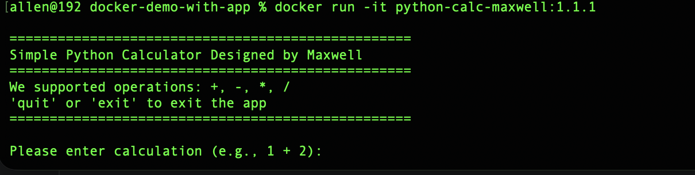

# docker-demo-with-app
This demo is for people who wants to write a Dockerfile from the very beginning, In this demo, 

I will write a Dockerfile to package my python main.py code

## Usage

- build the python app image

```shell
docker build -f Dockerfile -t python-calc-maxwell:1.1.1 .

```

- Run the iamge to create container, since the python app need user inputs , so remeber with  "-it"

```shell
docker run -it python-calc-maxwell:1.1.1 

```

- python app is running like this:




- remove all the containers (running or stopped)

```shell
docker rm -f $(docker ps -aq)

```

## if you want to know more about cmd and entrypoint in Dockerfile please check my another folder named cmd-entrypoint-diff in this repo


